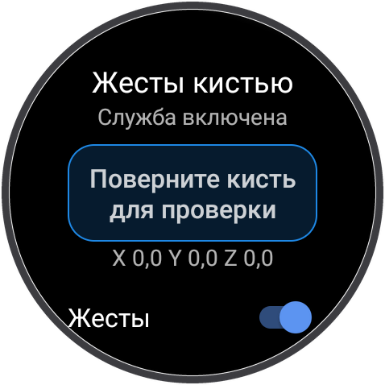
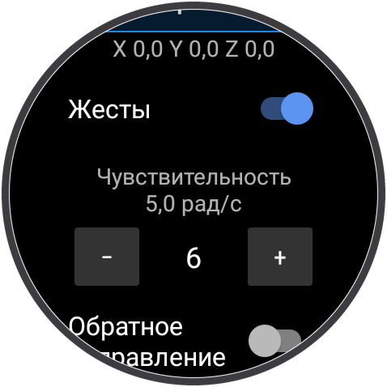
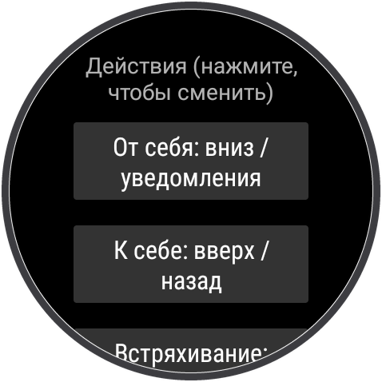

# Жесты кистью для Wear OS 3+

[English version](README.en.md)

[](https://github.com/iRapoo/WristGestures/releases/latest)
[](https://github.com/iRapoo/WristGestures/releases)
[](https://github.com/iRapoo/WristGestures/actions/workflows/release.yml)

[](LICENSE)

Возвращает **жесты кистью** из Wear OS 2, которые пропали после обновления до Wear OS 3
(например, на Mobvoi TicWatch Pro 3). Поворотом кисти можно открыть уведомления, быстрые
настройки и листать списки, не касаясь экрана.

<p align="center">
  <a href="https://github.com/iRapoo/WristGestures/releases/latest/download/WristGestures.apk">
    
  </a>
  <br>
  <sub>Последняя версия · <a href="https://github.com/iRapoo/WristGestures/releases">все релизы</a> · <a href="#установка">как установить</a></sub>
</p>

<p align="center">
  
  
  
</p>

| Жест | Как выполнить | Действие по умолчанию |
|---|---|---|
| **От себя** | быстро повернуть кисть от себя и вернуть | на циферблате открыть уведомления; в списках листать вниз; в быстрых настройках закрыть их |
| **К себе** | быстро повернуть кисть к себе и вернуть | на циферблате открыть быстрые настройки; в списках листать вверх; в начале списка закрыть экран |
| **Встряхивание** | 2–3 быстрых поворота туда-обратно, как будто стряхиваете воду | назад (на циферблате ничего) |

Жесты работают во всём интерфейсе: в уведомлениях, списке приложений, настройках и в обычных
приложениях. Любое действие можно поменять. **Root не нужен, доступа в интернет нет, данные
никуда не отправляются.**

---

## Содержание

- [Проверено на часах](#проверено-на-часах)
- [Как это работает коротко](#как-это-работает-коротко)
- [Установка](#установка)
- [Настройка и калибровка](#настройка-и-калибровка)
- [Батарея](#батарея)
- [Приватность и безопасность](#приватность-и-безопасность)
- [Если что-то не работает](#если-что-то-не-работает)
- [Сообщить о проблеме](#сообщить-о-проблеме)
- [Удаление](#удаление)
- [Разработчикам](#разработчикам)
- [Лицензия](#лицензия)

---

## Проверено на часах

| Часы | Версия Wear OS | Результат |
|---|---|---|
| Mobvoi TicWatch Pro 3 GPS | 3.5 (RMRB.240228.002) | работает всё |

Проект молодой и пока проверен на одной модели. На других часах с Wear OS 3+ и гироскопом
тоже должно работать, но системный интерфейс у производителей отличается. Если попробовали на
своих часах, [напишите](#сообщить-о-проблеме), что получилось: модель добавится в таблицу.

## Как это работает коротко

1. Пока экран включён, приложение 50 раз в секунду читает **гироскоп**.
2. Жест — это короткий быстрый поворот и такой же быстрый поворот обратно. Распознаватель ищет
   именно такой рисунок и не реагирует на медленные движения, например когда вы поднимаете
   руку посмотреть на часы. Подробно: [docs/ALGORITHM.md](docs/ALGORITHM.md).
3. Действие выполняет **служба специальных возможностей**: на Wear OS это единственный способ
   для обычного приложения листать экраны и имитировать касания.
4. Когда экран гаснет или переходит в режим ambient, гироскоп отключается.

## Установка

Понадобятся часы на **Wear OS 3 или новее** (Android 11+) с **гироскопом** и компьютер с
**ADB** ([Android SDK Platform Tools](https://developer.android.com/tools/releases/platform-tools)).
Компьютер нужен один раз: установить приложение и включить службу.

### 1. Подключиться к часам по ADB

На часах:

1. **Настройки → Система → О часах → Версии**: 7 раз нажмите на **Номер сборки**, чтобы
   появились параметры разработчика.
2. **Настройки → Для разработчиков**: включите **Отладку по ADB** и **Отладку по Wi-Fi**
   (на некоторых часах пункт называется **Беспроводная отладка**).
3. Подключите часы к **той же сети Wi-Fi**, что и компьютер, и запомните IP-адрес и порт,
   которые показаны под пунктом отладки.

На компьютере:

```bash
# Wear OS 3 на TicWatch и похожих: адрес показан как IP:5555
adb connect 192.168.1.50:5555

# На новых часах с «Беспроводной отладкой» сначала нужно сопряжение:
#   на часах: Беспроводная отладка → Подключить устройство → запомнить IP:порт и код
adb pair 192.168.1.50:37123
adb connect 192.168.1.50:41234

adb devices   # часы должны быть в списке со статусом "device"
```

Если на часах появится запрос на отладку, подтвердите его.

> **Совет:** когда часы связаны с телефоном по Bluetooth, они отключают Wi-Fi ради экономии.
> Если соединение пропадает, откройте на часах настройки Wi-Fi и не давайте экрану погаснуть,
> пока выполняются команды.

### 2. Скачать APK

Скачайте [WristGestures.apk](https://github.com/iRapoo/WristGestures/releases/latest/download/WristGestures.apk)
из последнего релиза. Каждый релиз собирается GitHub Actions прямо из исходного кода с
соответствующим тегом, [журнал сборок](https://github.com/iRapoo/WristGestures/actions) открыт.

Хотите собрать сами — см. [Разработчикам](#разработчикам).

### 3. Установить

```bash
adb install -r WristGestures.apk
```

Новая версия ставится той же командой поверх старой. Настройки и включённая служба
сохраняются.

### 4. Включить службу специальных возможностей

Всю работу делает служба, её нужно включить один раз. После перезагрузки и обновления
приложения она остаётся включённой.

**Вариант А — на часах.** Откройте **Настройки → Спец. возможности** и включите **Жесты кистью**
или нажмите **Спец. возможности** внизу экрана приложения.
Во многих прошивках Wear OS сторонние службы там **не показываются**. Тогда используйте вариант Б.

**Вариант Б — через ADB.** Сначала проверьте, не включены ли уже другие службы:

```bash
adb shell settings get secure enabled_accessibility_services
```

Если ответ `null` или пустой:

```bash
adb shell settings put secure enabled_accessibility_services xyz.quenix.wristgestures/.service.GestureService
adb shell settings put secure accessibility_enabled 1
```

Если команда что-то вывела (например, `com.example/.SomeService`), **сохраните это значение** и
допишите нашу службу через двоеточие. Иначе другая служба выключится:

```bash
adb shell settings put secure enabled_accessibility_services com.example/.SomeService:xyz.quenix.wristgestures/.service.GestureService
adb shell settings put secure accessibility_enabled 1
```

Откройте приложение: в верхней строке должно быть **Служба включена**.

## Настройка и калибровка

Откройте **Жесты кистью** на часах. Пока этот экран открыт, жесты только **показываются** в
рамке сверху и не выполняются, так что экспериментировать безопасно.

| Настройка | Что делает |
|---|---|
| **Жесты** | Общий выключатель. Когда выключен, гироскоп не используется совсем. |
| **Чувствительность** | 1 — только резкие повороты, 10 — лёгкие. Над кнопками показан порог в рад/с. Если жесты срабатывают случайно, уменьшите; если срабатывают с трудом, увеличьте. |
| **Обратное направление** | Меняет местами «от себя» и «к себе». Включите, если направления перепутаны, например когда часы на правой руке. |
| **Вибрация** | Короткий отклик, когда жест распознан. |
| **Действия** | Нажимайте на строку, чтобы перебрать действия для жеста: ничего, вниз / уведомления, вверх / назад, уведомления, назад, циферблат. |
| **Ось гироскопа** | Ось, вокруг которой поворачивается кисть. Для большинства часов подходит **X**. Числа под рамкой показывают пиковую скорость поворота по каждой оси за последнюю секунду: поверните кисть и выберите ось с самым большим числом. |

Как настроить:

1. Наденьте часы и откройте приложение.
2. Сделайте несколько поворотов от себя и к себе. Проверьте, что в рамке правильное
   направление. Если перепутано, включите **Обратное направление**.
3. Подвигайте рукой как обычно: поднимите кисть, пожестикулируйте. Если в рамке появляются
   ложные жесты, уменьшите **Чувствительность**.
4. Выйдите на циферблат и попробуйте: от себя — уведомления, ещё раз от себя — листать вниз,
   к себе — вверх, в начале списка уведомления закроются. К себе на циферблате — быстрые
   настройки, от себя — закрыть их.

**Жесты работают только при включённом экране** (не в режиме ambient), как и в Wear OS 2.
Сначала поднимите руку или коснитесь экрана.

## Батарея

- Гироскоп работает только при **включённом** экране и отключается в режиме ambient и при
  выключенном экране. В режиме ожидания приложение ничего не делает.
- При включённом экране приложение обрабатывает 50 замеров в секунду, в каждом по несколько
  арифметических операций. Само по себе оно не держит процессор включённым.
- Точных замеров расхода пока нет. Если заметите разницу во времени работы, напишите об этом
  и укажите модель часов.

## Приватность и безопасность

Служба специальных возможностей — мощное разрешение, поэтому вот всё, что приложение с ним делает:

| Разрешение / возможность | Зачем |
|---|---|
| Спец. возможности: *выполнение жестов* | Имитация свайпа там, где нельзя прокрутить напрямую. |
| Спец. возможности: *доступ к содержимому окна* | Найти на экране прокручиваемый список и прокрутить его. Содержимое читается только в момент жеста, никуда не сохраняется и не передаётся. |
| `VIBRATE` | Виброотклик. |
| Гироскоп | Распознавание жестов. Разрешение не требуется. |

- У приложения **нет разрешения INTERNET**, поэтому оно физически не может ничего никуда
  отправить. Это видно в [AndroidManifest.xml](app/src/main/AndroidManifest.xml).
- Никаких сторонних библиотек, аналитики и рекламы: только Android framework.
- Исходный код короткий и полностью прокомментирован.

### Проверка подлинности APK

Все официальные релизы подписаны одним ключом. Отпечаток SHA-256 сертификата:

```
b5a17b1d96e9e53abe4180d176215002c05cfdcf9c0dedc2ef0a1ab1f19f34bc
```

Проверить скачанный файл (`apksigner` входит в Android SDK Build Tools):

```bash
apksigner verify --print-certs WristGestures.apk
```

Строка `Signer #1 certificate SHA-256 digest` должна совпадать с отпечатком выше. Если не
совпадает, это не официальная сборка.

## Если что-то не работает

**«Служба выключена», хотя я её включал.**
Её выключает **принудительная остановка** приложения («Остановить» в настройках или
`am force-stop`): Android сам убирает службу из списка включённых. Включите заново (шаг 4
установки). Если после команд ADB служба всё равно не запускается, сбросьте список и задайте
его ещё раз:

```bash
adb shell settings put secure enabled_accessibility_services null
adb shell settings put secure enabled_accessibility_services xyz.quenix.wristgestures/.service.GestureService
adb shell settings put secure accessibility_enabled 1
```

**`INSTALL_FAILED_UPDATE_INCOMPATIBLE` при установке.**
На часах стоит версия, подписанная другим ключом (например, собранная самостоятельно). Удалите
её (`adb uninstall xyz.quenix.wristgestures`), установите заново и снова включите службу.

**В рамке жесты видны, а на экране ничего не происходит.**
Проверьте, что служба включена (верхняя строка приложения) и что для жеста не выбрано действие
*ничего*. Пока открыт экран приложения, жесты намеренно не выполняются.

**Направления перепутаны.** Включите **Обратное направление**.

**Случайные срабатывания при ходьбе или наборе текста.**
Уменьшите чувствительность или поставьте для мешающего жеста действие *ничего*.

**Поворот на циферблате делает не то, что описано.**
Системный интерфейс ваших часов устроен иначе, чем на TicWatch. Сообщите об этом (см. ниже),
чтобы добавить поддержку.

## Сообщить о проблеме

Создайте [issue](https://github.com/iRapoo/WristGestures/issues/new/choose) и укажите:

- модель часов и версию Wear OS (**Настройки → Система → О часах**);
- версию приложения;
- что делали, что ожидали и что произошло.

Отзывы вида «работает на моих часах» тоже очень полезны.

## Удаление

```bash
adb uninstall xyz.quenix.wristgestures
```

или удалите из списка приложений на часах. Настройка спец. возможностей очистится сама.

## Разработчикам

### Сборка

```bash
git clone https://github.com/iRapoo/WristGestures.git
cd WristGestures
./gradlew testDebugUnitTest   # тесты распознавателя, часы не нужны
./gradlew assembleRelease     # Windows: gradlew.bat assembleRelease
```

Нужны JDK 17+ и Android SDK, проще всего открыть проект в Android Studio. APK появится в
`app/build/outputs/apk/release/app-release.apk`. Самостоятельно собранный APK подписан вашим
отладочным ключом и не может обновить официальный релиз.

### Структура проекта

```
app/src/main/java/xyz/quenix/wristgestures/
├── detection/
│   ├── FlickRecognizer.kt     # распознаватель жестов на чистом Kotlin (покрыт тестами)
│   └── GyroGestureSource.kt   # передаёт данные гироскопа в распознаватель
├── service/
│   ├── GestureService.kt      # служба спец. возможностей: жизненный цикл, экран вкл/выкл, жест → действие
│   └── ActionPerformer.kt     # выполняет действия: прокрутка, свайп, назад, домой
├── settings/
│   └── GestureSettings.kt     # SharedPreferences, перечисления Axis и GestureAction
├── ui/
│   └── MainActivity.kt        # экран настроек и калибровки
└── LiveState.kt               # флаг «открыт экран калибровки», общий со службой
```

Приложение использует только Android framework, без AndroidX и других библиотек, чтобы
оставаться лёгким на часах с 1 ГБ памяти.

### Отладка

```bash
./gradlew installDebug        # отладочная сборка на подключённые часы
adb logcat -s WristGestures   # жесты, действия и структура экрана перед каждым действием
```

Отладочная сборка принимает жесты с компьютера, так что действия можно проверять, не двигая
рукой:

```bash
# Не слушать настоящий гироскоп во время теста (чтобы вернуть, отправьте false)
adb shell am broadcast -a xyz.quenix.wristgestures.DEBUG_GESTURE --ez pause_sensor true

# Выполнить жест: FLICK_OUT, FLICK_IN или SHAKE
adb shell am broadcast -a xyz.quenix.wristgestures.DEBUG_GESTURE --es gesture FLICK_OUT
```

Журнал показывает каждое движение, которое видит распознаватель. Так проще всего подобрать
пороги на новых часах:

```
lobe sign=-1 peak=6,6 duration=77ms gap=0ms
lobe sign=1 peak=19,6 duration=97ms gap=38ms
sequence lobes=2 -> FLICK_IN
```

### Документация

- [docs/ALGORITHM.md](docs/ALGORITHM.md) — как распознаются жесты, с реальными замерами.
- [docs/SYSTEM_UI.md](docs/SYSTEM_UI.md) — как устроен интерфейс TicWatch и почему действия
  сделаны именно так.
- [docs/RELEASING.md](docs/RELEASING.md) — выпуск релиза и подпись APK.

### Как добавить действие

1. Добавьте константу в `GestureAction` в `settings/GestureSettings.kt`.
2. Добавьте подпись в `res/values/strings.xml` и `res/values-ru/strings.xml`.
3. Обработайте действие в `ActionPerformer.perform`.

Оно само появится в списке действий на экране настроек.

### Как добавить жест

1. Добавьте константу в `Gesture` в `detection/FlickRecognizer.kt` и распознайте его в
   `finishSequence` (или в новом распознавателе).
2. Добавьте действие по умолчанию в `GestureSettings.defaultAction`, подпись в
   `MainActivity.gestureLabel` и строку в `activity_main.xml`.
3. Покройте жест тестом в `FlickRecognizerTest`.

Pull request'ы приветствуются.

## Лицензия

[MIT](LICENSE). Можно свободно использовать, изменять и распространять.

Проект не связан с Mobvoi и Google. TicWatch — товарный знак Mobvoi, Wear OS — товарный знак
Google LLC. Приложение распространяется «как есть», без гарантий.
